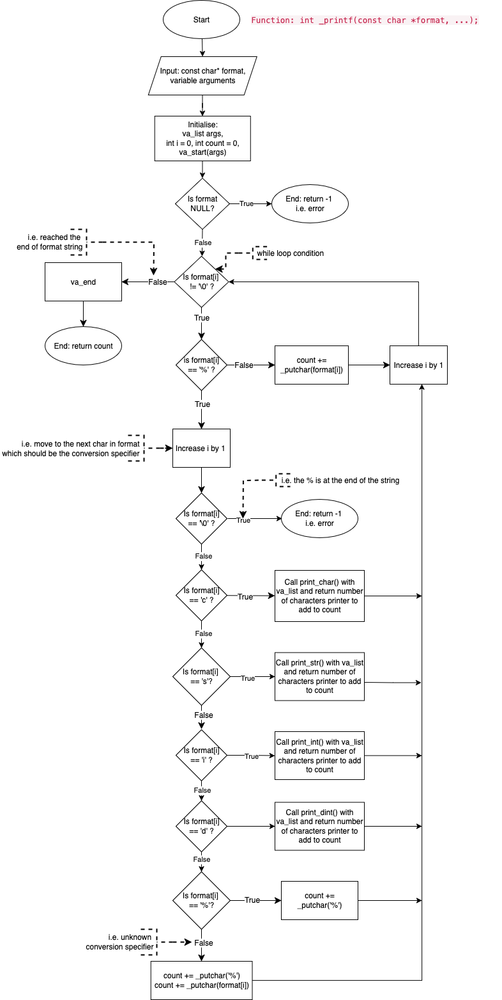

# _PRINTF Project
This repository is for the purpose of the Holberton School's _printf group project.

## Description
The _printf function formats and prints data to standard output(stdout) according to the specified format. The format specifier is a character string that contains conversion specifiers that indicates how the arguments should be formatted and displayed.

## Flowchart

The flowchart illustrates the logic and control flow of the custom _printf function, mimicking the behaviour of the standard printf function in C.
- Function Entry – `_printf(const char *format, ...)`  
The function starts by receiving a format string and a variable number of arguments. It initialises necessary variables and sets up the va_list to access the arguments.  

- Looping  
The function enters a loop to iterate through each character of the format string: If a character is not a percent sign (%), it's printed directly using _putchar.
If a character is a percent sign, the next character is treated as a format specifier.

- Format Specifier Handling  
Using a mapping structure (an array of structs) called printer matches the specifier (e.g., 'c', 's', 'd' , 'i', '%') with its corresponding print function (like print_char, print_string or print_int). The corresponding function is called, and the correct arugment is retrived using va_arg.

- Output  
Each specific handler function (e.g., print_int, print_char) processes its input and uses _putchar or helper functions to print the output one character at a time. The function also keeps track of how many characters have been printed in total.

- Completion  
Once the format string has been fully parsed and all arguments printed, _printf ends by cleaning up the va_list and returning the total numbers of characters printed.

## Contribution Guidelines

If you would like to contribute to the project development:

1. Fork the repository.
2. Create a new branch for your feature or bug fix.
3. Make your changes and submit a pull request.

Feel free to adjust any details or formatting to better suit your project and preferences!

## License

This project is licensed under the MIT License.

## Contributors
<strong>sheeny84</strong> | <strong>by-emrii</strong> | <strong> carlaciar</strong>
